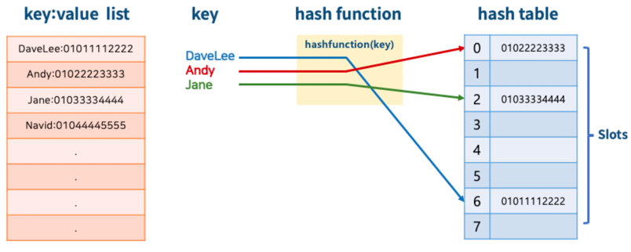

잔재미 강사님의 강의를 보고 개인적으로 공부하기 위한 md 정리 파일

linked List
- 하나의 저장될 데이터가 있을때마다 다음 데이터가 있을때 두 가지 저장 공간을 가지게 된다.
- 첫번째 노드가 다음 데이터 주소를 가지고 있고, 다음 데이터도 그다음 데이터의 주소를 가리키는것.
- 장점은 미리 데이터 공간을 할당하지 않아도 된다.
  - 배열은 미리 데이터 공간을 할당해야 한다.
- 단점은 다음 데이터 공간이 필요하므로 저장곤간 효율이 높지 않다.
- 연결 정보를 찾는 시간이 필요하므로 접근 속도가 느리다.
- 중간 데이터 삭제시, 앞뒤 데이터의 연결을 재구성해야 하는 부가적인 작업 이 필요하다.

---
알고리즘 복잡도 표현 방법
- 하나의 문제를 푸는 알고리즘은 다양할 수 있음
  - 정수의 절대값 구하기 
    - 1, -1 ->> 1
    - 방법1: 정수값을 제곱한 값에 다시 루트를 씌우기
    - 방법2: 정수가 음수인지 확인해서, 음수일 때만, -1 을 곱하기

> 다양한 알고리즘 중 어느 알고리즘이 더 좋은지를 분석기 위해 , 복잡도를 정의하고 계산함.

- 복잡도는 보통 어떻게 정희하나욘 ? 
  1. 시간 복잡도 : 알고리즘 실행 속도
  2. 공간 복잡도 : 알고리즘이 사용하는 메모리 사이즈
  
> 가장 중요한 시간 복잡도를 꼭 이해하고 계산할 수 있어야함.

- 입력의 크기가 커지면 커질수록 반복문이 알고리즘 수행 시간을 지배함.

### 3. 대문자 O 표기법
* 빅 오 표기법, Big-O 표기법 이라고도 부름
* O(입력)
  - 입력 n 에 따라 결정되는 시간 복잡도 함수
  - O(1), O($log n$), O(n), O(n$log n$), O($n^2$), O($2^n$), O(n!)등으로 표기함
  - 입력 n 의 크기에 따라 기하급수적으로 시간 복잡도가 늘어날 수 있음
    - O(1) < O($log n$) < O(n) < O(n$log n$) < O($n^2$) < O($2^n$) < O(n!)
      - 참고: log n 의 베이스는 2 - $log_2 n$
        <br><br>
* 단순하게 입력 n에 따라, 몇번 실행이 되는지를 계산하면 됩니다.
  - **표현식에 가장 큰 영향을 미치는 n 의 단위로 표기합니다.**
  - n이 1이든 100이든, 1000이든, 10000이든 실행을
    - 무조건 2회(상수회) 실행한다: O(1)
       ```java
            if (n > 10) {
                System.out.println(n);
            }
            
       ```
    - n에 따라, n번, n + 10 번, 또는 3n + 10 번등 실행한다: O(n)
      - 다음 코드는 이중 반복문이지만, 상위는 상수로 반복하므로, 3n 실행
       ```java
            for (int num = 0; num < 3; num++) {
                for (int index = 0; index < n; index++) {
                    System.out.println(index)
                }
            }
       ```
    - n에 따라, $n^2$번, $n^2$ + 1000 번, 100$n^2$ - 100, 또는 300$n^2$ + 1번등 실행한다: O($n^2$)
      - 다음 코드는 삼중 반복문이지만, 상위는 상수로 반복하므로, 3$n^2$ 실행
       ```java
            for (int i = 0; i < 3; i++) {
                for (int num = 0; num < n; num++) {
                    for (int index = 0; index < n; index++) {
                            System.out.println(index)
                    }
                }
            }
       ```
      
>
* 빅 오 입력값 표기 방법
  - 예:
    - 만약 시간 복잡도 함수가 2$n^2$ + 3n 이라면
      - 가장 높은 차수는 2$n^2$
      - 상수는 실제 큰 영향이 없음
      - 결국 빅 오 표기법으로는 O($n^2$) (서울부터 부산까지 가는 자동차의 예를 상기)

#### 시간 복잡도 구하기
* 1부터 n까지의 합을 구하는 알고리즘1
  - 입력 n에 따라 덧셈을 n 번 해야 함 (반복문!)
  - 시간 복잡도: n, 빅 오 표기법으로는 **O(n)**

## 대표적인 데이터 구조: 해쉬 테이블 (Hash Table)

### 1. 해쉬 테이블
- 키(Key)에 데이터(Value)를 매핑할 수 있는 데이터 구조
- 해쉬 함수를 통해, 배열에 키에 대한 데이터를 저장할 수 있는 주소(인덱스 번호)를 계산
- Key를 통해 바로 데이터가 저장되어 있는 주소를 알 수 있으므로, 저장 및 탐색 속도가 획기적으로 빨라짐
- 미리 해쉬 함수가 생성할 수 있는 주소(인덱스 번호)에 대한 공간을 배열로 할당한 후, 키에 따른 데이터 저장 및 탐색 지원
 - 
### 2. 알아둘 용어
* 해쉬 함수(Hash Function): 임의의 데이터를 고정된 길이의 값으로 리턴해주는 함수
  - 해쉬 (Hash), 해쉬 값(Hash Value), 또는 해쉬 주소(Hash Address): 해싱 함수를 통해 리턴된 고정된 길이의 값
* 해쉬 테이블(Hash Table): 키 값의 연산에 의해 직접 접근이 가능한 데이터 구조
  - 슬롯(Slot): 해쉬 테이블에서 한 개의 데이터를 저장할 수 있는 공간


hashTable 은 hashFunction 이 리턴 할 수 있는
데이터 주소 공간을 미리 확보한다. 배열로 확보를 하고,
인덱스 가 데이터의 주소가 된다. 그다음 key 에 대한 데이터를 적절한 위치에 저장을 하고 ,
각각 의 실제 데이터가 저장되는 데이터 공간을 slot 이라고 한다.
미리 확보 되는 공간을 hashTable 이라고 하고

